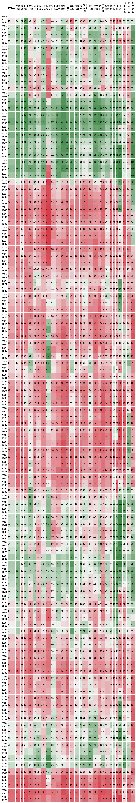

# Market-Breadth
计算美股、A股市场宽度

### 数据格式
使用 MySQL 存储数据，目前美股和A股各有两张表，具体表接口参加 config/sql/xxx.sql 文件，以A股为例：
```
zh_stocks_info.sql 生成 zh_stocks_info 表: 股票基础数据
zh_stocks_d.sql 生成 zh_stocks_d 表: 日线周期数据
zh_stocks_sector_sw_d.sql 生成 计算市场宽度依赖的视图
tmp_zh_stocks_sw_sector_d 
zh_stocks_sector_sw_d
```
#### 使用docker本地运行mysql(默认mysql安装配置繁琐建议使用docker直接运行)
+ 1. docker中运行mysql <br>
```shell
docker pull mysql 
docker run  -e MYSQL_ROOT_PASSWORD=233233 -p 3306:3306  -v /home/pluswu/Data/mysql:/var/lib/mysql -d mysql --character-set-server=utf8mb4 --collation-server=utf8mb4_unicode_ci 
```

+ 2. 创建数据库和表 <br>
```shell
mysql -u root -P 3306 -h 0.0.0.0 -p < create_db.sql 
mysql -u root -P 3306 -h 0.0.0.0 -D stocks -p < us_stocks_d.sql 
mysql -u root -P 3306 -h 0.0.0.0 -D stocks -p < us_stocks_info.sql 
mysql -u root -P 3306 -h 0.0.0.0 -D stocks -p < us_stocks_sector_d.sql
mysql -u root -P 3306 -h 0.0.0.0 -D stocks -p < zh_stocks_d.sql
mysql -u root -P 3306 -h 0.0.0.0 -D stocks -p < zh_stocks_info.sql
mysql -u root -P 3306 -h 0.0.0.0 -D stocks -p < zh_stocks_sector_sw_d.sql
mysql -u root -P 3306 -h 0.0.0.0 -D stocks -p < zh_stocks_industries_d.sql
```

### 数据获取
A 股使用 Tushare 获取，欢迎使用 https://tushare.pro/register?reg=296500 注册邀请链接帮我加积分。
```python 
    pip install tushare
```
申请之后记得替换 config.conf 中的 token 配置项。

美股使用 yfinance 获取：
```python 
    pip install yfinance
```
其他库依赖：
+ opendatatools
+ requests
+ bs4
+ pandas
+ TA-Lib

遇到什么安装什么即可。。。

### 运行分析
#### 1. 获取 A 股市场宽度
+ 1. 获取 A 股全市场股票基本信息：
```python   
    python task/zh_get_info.py
```
+ 2. 计算 A 股市场宽度图表：
```python   
    python task/zh_get_daily.py
```
获取数据时间比较久，请耐心等待，预计 1-2 个小时。
+ 3. 示例：
<div align="center">
	
</div>

#### 1. 获取 美股标普500 市场宽度
注意：美股数据获取最好使用科学上网。
+ 1. 获取美股全市场股票基本信息：
```python   
    python task/us_get_info.py
```
+ 2. 计算 美股标普500 市场宽度图表：
```python   
    python task/us_get_daily.py
```
获取数据时间比较久，请耐心等待，预计 1-2 个小时。
+ 3. 美股示例在 `data/Market-Breadth-US.jpg`

#### 惊喜：
在计算过程中该程序已经计算了全市场股票的 破线、交叉、拐头 等数据，您可以用 sql 在 mysql 中自行分析。

#### 如果觉得对您有帮助，欢迎请我喝杯咖啡：

+ 微信：
<div>
	
</div>

+ 支付宝：
<div>
	
</div>